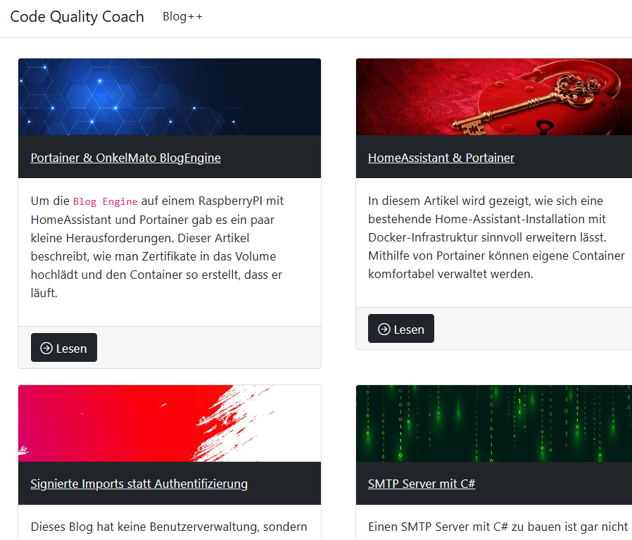
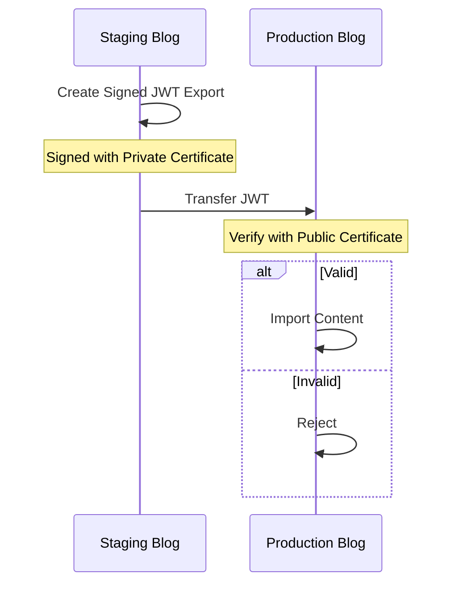

# Onkel Mato Blog Engine

This is a lightweight and flexible blogging engine built with ASP.NET Core using Razor Pages for a clean, server-side rendered architecture. The application leverages Entity Framework Core as its data access layer, providing seamless integration with multiple database backends. It supports both Microsoft SQL Server and SQLite databases, allowing you to choose the right storage solution for your deployment scenario. The project includes automatic database migrations and can be easily containerized using Docker for simplified deployment. With its straightforward design and database flexibility, this blog engine is ideal for personal blogs, small team websites, or as a foundation for custom content management solutions.

## Layers

The project is organized into three distinct layers, each with specific responsibilities and concerns. The **Core** layer serves as the foundation of the application, housing all essential business logic, database contexts, and cross-functional services that can be reused throughout the system. This layer contains Entity Framework Core implementations, repositories, and domain models that provide database abstraction and data access functionality. The **BlogEngine** layer builds upon the Core, providing the administrative interface with pages and components necessary for content management and configuration. Finally, the **Web** layer represents the public-facing application, delivering a complete and ready-to-use blog experience with an index page for listing posts, detail pages for individual articles, and responsive header and footer components. This layered architecture promotes separation of concerns, making the codebase maintainable, testable, and extensible for future enhancements.

Each layer can be used independently as a foundation to build a custom blog website on top, allowing developers to choose the appropriate starting point based on their specific requirements and desired level of customization.

## Authentication & Authorization

Traditional authentication and authorization mechanisms have been replaced with a signed import system. This approach ensures that only content signed with trusted certificates can be imported and published to the blog, providing security through cryptographic verification rather than conventional user authentication.

## Import & Export

The blog engine features a secure import and export functionality that leverages digital certificates for data integrity and authenticity verification. When exporting blog content, the system creates a signed JSON Web Token (JWT) that contains all the necessary data while ensuring its authenticity through cryptographic signatures. This signed token can then be imported into another instance of the blog engine, where the certificate is validated before any data is written to the database. For JSON-based exports, the system generates two files: the actual data file and a separate signature file that contains the cryptographic proof of authenticity. The certificate management and signing process can be explored in detail by examining the [certs/SignExport.ps1](certs/SignExport.ps1) script, which demonstrates how to create and manage certificates for the export functionality. This certificate-based approach ensures that only trusted and verified content can be imported, protecting against data tampering and maintaining the integrity of your blog content across different deployments. The signing mechanism provides a robust solution for migrating blog content between environments while maintaining security and trust.

## Docker Support

The blog engine is fully containerized and ready for deployment using Docker, providing a streamlined path from development to production. The application uses environment variables to configure behavior across different deployment stages, with all configuration settings managed through the [appsettings.json](src/OnkelMato.BlogEngine.Web/appsettings.json) file. For staging or development environments where you need administrative access to create, edit, and export blog content, enable administration mode and configure both private and public certificates for signing operations:

    docker run -p 8080:8080 \
      -e "Blog__AllowAdministration=true" \
      -e "ImportExport__JwtPrivateCertificates__0=/data/demo.key" \
      -e "ImportExport__JwtPublicCertificates__0=/data/demo.crt" \
      -v ".\\ombe.data\\:/data" \
      thomasley/onkelmatoblogengineweb

The administration flag enables full editing capabilities and the export functionality, while the certificate paths point to your signing keys stored in the mapped data directory. For production deployments, security best practices recommend running in read-only mode with only the public certificate configured for import validation, ensuring that content can only be published through the secure signed import process:

    docker run -p 8080:8080 \
      -v ".\\ombe.data\\:/data" \
      -e "ImportExport__JwtPublicCertificates__0=/data/demo.crt" \
      thomasley/onkelmatoblogengineweb

Production mode disables the administration interface by default, preventing direct editing and ensuring that all content must be properly signed and verified before publication. The database is automatically created and managed within the `/data` directory, which should be mapped to persistent storage for data retention across container restarts. Sample certificate files and the signing utility can be found in the [certs](certs/) directory, including the [SignExport.ps1](certs/SignExport.ps1) PowerShell script for certificate management.
